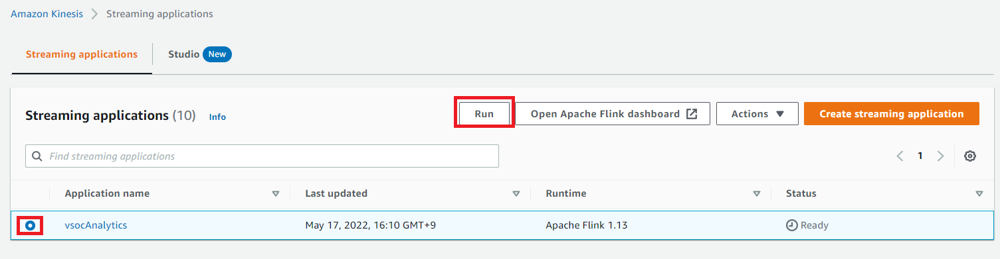
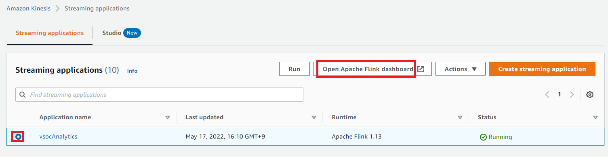
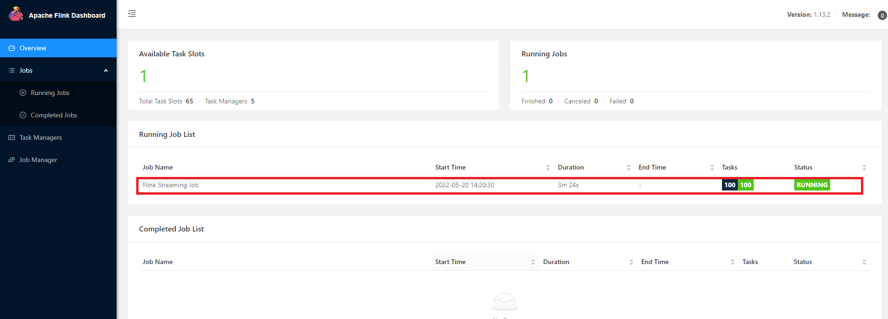
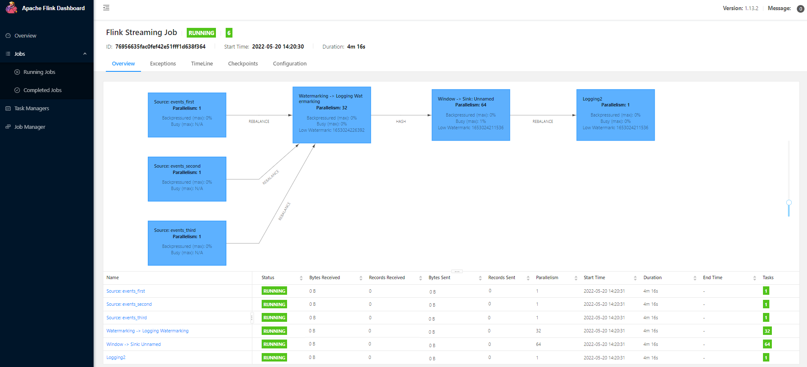
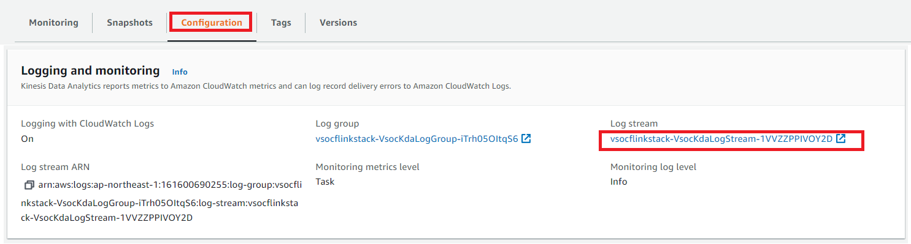
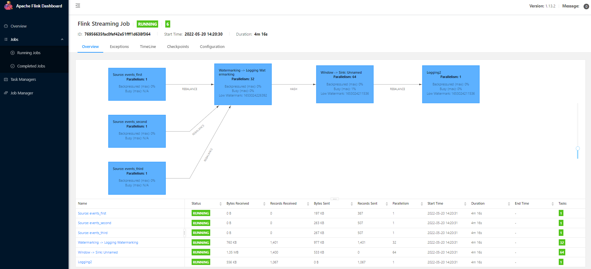
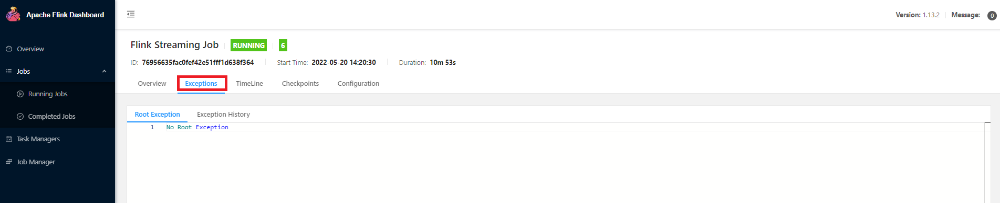

# KDA Flink
 
## モジュール格納ファイル説明
    kda
    └───cfn
    │   │───cfn_flinkDeployment.yaml               : cfn for deploying flink  (KDA) 
    │   └───flinkDeploy.sh                         : deploy shell
    │───images                                     : folder for placing images of document
    │───src
    │   └───main
    │       │───java\com
    │       │    └───amazonaws\kinesisanalytics\flink\streaming\etl
    │       │         │───function                    : source and sink function
    │       │         │───sim                         : dummy input source
    │       │         │───utils                       : utilities function
    │       │         └───StreamingEtl.java           : main source
    │       └───resources
    │            └───log4j.properties                 : logger configuration
    │───pom.xml                                       : information and build configuration 
    └───ReadMe.md
    
## 前提条件
 
### モジュールよりjarを作成する
 * Javaコンパイル環境を構築する
    * java version: 11
    * apache-maven version: 3.8.2

 * 作成されたJarファイル名とバージョンを変更したい場合、pom.xmlを編集する
  ```sh
  $ cat pom.xml
    ...
	<groupId>com.amazonaws</groupId>
	<artifactId>flink-join-streams</artifactId> -> Jar名
	<version>0.0.0</version>                    -> Version
	<packaging>jar</packaging>
    ...
  ```
 * コマンドを使用して、jarモジュールを作成する。 作成されたjarファイルは、targetというフォルダーの下にある。

  ```sh
  $ cd flink
  $ mvn compile
  $ mvn package
  ```

 * 作成されたjarファイル<e.g.:flink-join-streams-0.0.0.jar>をS3バケット<e.g.vsco-module-bucket>に置く
  ```sh
  $ aws s3 mb s3://vsco-module-bucket
  $ cd kda/target
  $ aws s3 cp flink-join-streams-0.0.0.jar s3://vsco-module-bucket/
  ```

## デプロイ方法

*  A. KDAを作成する
    + パラメータ説明

    | パラメータ                               | デフォルト値                      | 説明 |
    |:-------------------------------------|:-----------------------------|:--------------------------|
    | **FlinkJarS3Bucket**                 | vsco-module-bucket           | flinkjarモジュールを配置するS3バケット名 |
    | **FlinkJarName**                     | flink-join-streams-0.0.0.jar | S3バケットにjar名(フォルダを含め) |
    | KinesisAnalyticsName                 | vscoAnalytics                | KDA名|
    | DelayEventType1                      | 60000                        | ダミーデータ1の送信遅延時間 |
    | DelayEventType2                      | 0                            | ダミーデータ2の送信遅延時間 |
    | DelayEventType3                      | 0                            | ダミーデータ3の送信遅延時間 |
    | IntervalEventType1                   | 500                          | ダミーデータ1の送信間隔時間 |
    | IntervalEventType2                   | 500                          | ダミーデータ2の送信間隔時間 |
    | IntervalEventType3                   | 500                          | ダミーデータ3の送信間隔時間 |
    | NumOfCars                            | 2                            | ダミーカーの数           |
    | WindowSize                           | 100                          | 集計用ウインドウズサイズ|
    | WindowSizeUOM                        | MILLISECONDS                 | 集計用ウインドウズサイズの時間単位|
    | WatermarkDelay                       | 60100                        | ウインドウを閉じる遅延時間|
    | WatermarkDelayUOM                    | MILLIS                       | ウインドウを閉じる遅延時間単位|
    | ThreaWatermarking                    | 32                           | 性能：入力データを読み込むタスクスレッド数|
    | ThreadWindowing                      | 64                           | 性能：データを集計すｒタスクスレッド数|
    | ThreadLogging                        | 1                            | 性能：データを出力するタスクスレッド数|
    | ParallelismValue                     | 64                           | KDA設定：並行スレッド数|
    | ParallelismPerKPUValue               | 2                            | KDA設定：KPU数|
    | AutoScalingValue                     | false                        | KDA設定：アートースケーリングフラグ|

    + デプロイ手順
      * flinkDeploy.shにでパラメーター値を直接設定するか、exportより環境変数を設定してからデプロイすることができます。
        ```sh
        # flinkDeploy.shの設定値を確認してから実行してください。
        cd cfn
        chmod 755 flinkDeploy.sh 
        ./flinkDeploy.sh
        ```

    + 作成されたリソース確認
    1. 作成されたKinesisFlinkアプリケーション

        |Category        　          | property             | value              | 
        |:--------------------------|:---------------------|:-------------------|
        | Streaming applications    |Name                  |  vscoAnalytics               |
        | Application code location | Amazon S3 bucket      | s3://vsco-module-bucket |
        |                           | Path to S3 object     | flink-join-streams-0.0.0.jar |
        | Scaling                   | Parallelism           | 64 |
        |                           | Parallelism per KPU   | 2 |
        |                           | Automatic scaling     | false |
        | Runtime properties        ||| |
        | Group 'FlinkParallelismProperties'| THREAD_WATERMARKING | 32 |
        |                                   | THREAD_WINDOWING | 64 |
        |                                   | THREAD_LOGGING | 1 |
        | Group 'FlinkApplicationProperties'| DELAY_EVENT_TYPE1 |60000 |
        |                                   | DELAY_EVENT_TYPE2 | 0 |
        |                                   | DELAY_EVENT_TYPE3 | 0 |
        |                                   | INTERVAL_EVENT_TYPE1 | 500 |
        |                                   | INTERVAL_EVENT_TYPE2 | 500 |
        |                                   | INTERVAL_EVENT_TYPE3 | 500 |
        |                                   | NUM_OF_CARS | 2 |
        |                                   | WINDOW_SIZE | 100 |
        |                                   | WINDOW_SIZE_UOM | MILLISECONDS |
        |                                   | WATERMARK_DELAY | 60100 |
        |                                   | WATERMARK_DELAY_UOM | MILLIS |

## 実行手順

  * KDA Flinkアプリを起動する

    

  * ApachFlinkダッシュボードを開く

    

    

    

    * Flinkアプリケーションが[実行中のジョブリスト]に表示されていない場合は、起動が失敗したことを意味する。その時、ログを確認したほうが良い。

        

  * シミュレーターの実行を開始してデータを送信する

  * flinkアプリケーションの実行ステータスを確認する

    

       * 障害が発生した場合は、[例外]タブに切り替えて詳細を表示する。

           

## flinkアプリケーションの結果をCloudwatch insightで確認する方法
### check Watermarked Stream(input after union)
```
fields @timestamp, @message
| filter @message like /watermarkedStream/
| parse message /sourceType=(?<sourceType>.*?), eventTime=(?<eventTime>.*?), vin=(?<vin>.*?), source=(?<source>.*?), /
| sort @timestamp asc
| limit 2000
| display @timestamp, eventTime, vin, source, sourceType
```

### check Windowed Stream(output)
```
fields @timestamp, @message
| filter @message like /windowed_value/
| parse message /sourceType=(?<sourceType>.*?), windowStart=(?<windowStart>.*?), eventTime=(?<eventTime>.*?), cnt=(?<cnt>.*?), vin=(?<vin>.*?), source=(?<source>.*?), /
| sort eventTime asc
| limit 1000
| display windowStart, @timestamp, eventTime, cnt, vin, source, sourceType
```

### Debug ProcessWindowFunction 

```
fields @timestamp, @message
| filter @message like /ProcessWindowFunction:/
| parse message /sourceType=(?<sourceType>.*?), windowStart=(?<windowStart>.*?), eventTime=(?<eventTime>.*?), cnt=(?<cnt>.*?), vin=(?<vin>.*?), source=(?<source>.*?), /
| sort @timestamp asc
| limit 2000
| display windowStart, @timestamp, eventTime, cnt, vin, source, sourceType
```

```
fields @timestamp, @message
| filter @message like /ProcessWindowFunctionTreeMap/
| sort @timestamp asc
| limit 2000
| display @timestamp, message
```
